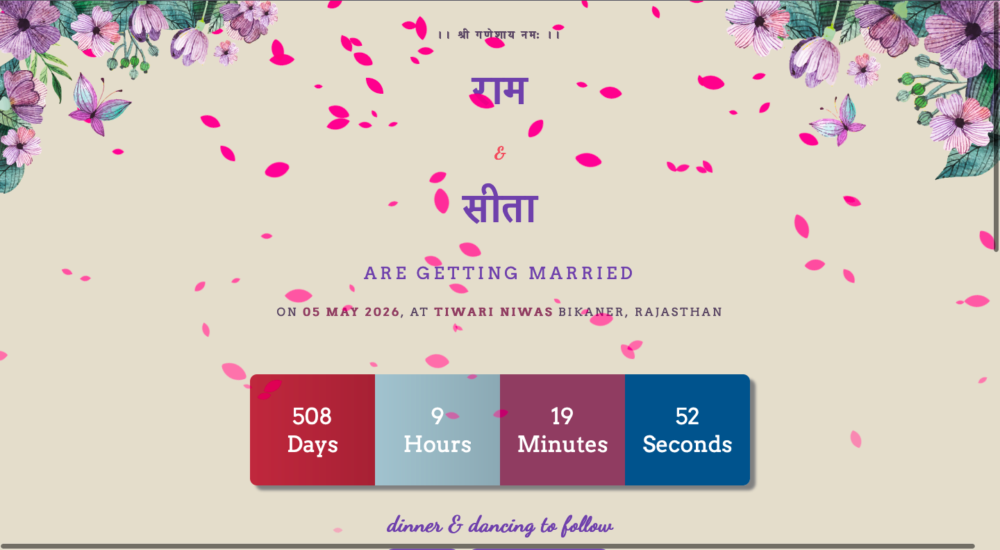

# Digital Wedding Invitation



## Overview
Digital Wedding Invitation is an open-source project that provides a visually appealing, customizable, and interactive wedding invitation webpage. It incorporates countdown timers, animations, and media integration to make the event memorable and engaging.

## Features
- Elegant design with floral decorations and animations.
- Real-time countdown timer until the wedding day.
- Interactive elements for venue directions and invitation card download.
- Fully responsive for mobile and desktop views.

## Libraries and Dependencies
This project uses the following technologies:
- **HTML5, CSS3, and JavaScript**: Core technologies for structure, styling, and interactivity.
- **Font Awesome**: For beautiful icons.
- **Google Fonts**: For custom font styles.
- **SweetAlert**: For dynamic alerts.

## Installation
To run this project locally, follow these steps:

1. Clone the repository:
   ```bash
   git clone https://github.com/cybertiwari/WeddingInvitation.git
   ```

2. Navigate to the project directory:
   ```bash
   cd WeddingInvitation
   ```

3. Open the `index.html` file using any local server (e.g., Python HTTP server):
   ```bash
   python -m http.server
   ```
   Alternatively, use tools like [VS Code Live Server](https://marketplace.visualstudio.com/items?itemName=ritwickdey.LiveServer).

4. Open the project in your browser at `http://localhost:8000` (or the port specified by your server).

## Usage
- Open the project in a web browser.
- View the countdown timer and interactive invitation design.
- Click on venue and download options for more details.

## Contributing
Contributions are welcome! Submit issues or pull requests to enhance the project.

## License
This project is licensed under the [MIT License](https://github.com/cybertiwari/WeddingInvitation/blob/master/LICENSE).

## Repository Link
[Digital Wedding Invitation GitHub Repository](https://github.com/cybertiwari/WeddingInvitation)